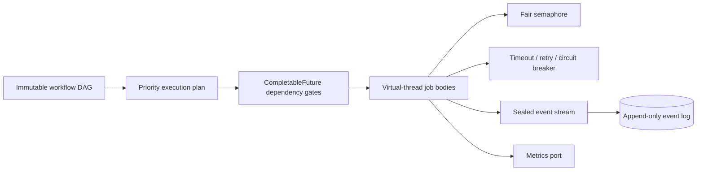
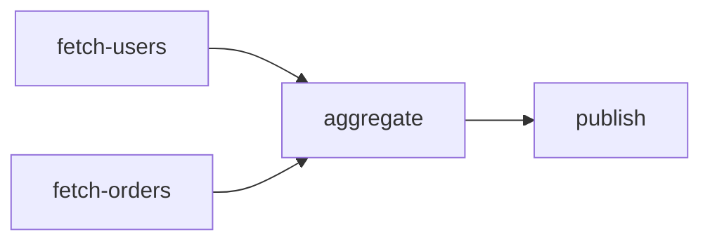

# task-orchestrator-java

[](https://github.com/NAOKI-Ko/task-orchestrator-java/actions/workflows/ci.yml)


[](LICENSE)

`task-orchestrator-java` is a compact workflow engine for safely executing dependency-aware jobs
in parallel. It focuses on modern Java's type system and concurrency model rather than wrapping a
CRUD framework.

## Why this exists

Batch and service code frequently mixes dependency ordering, futures, retry loops, timeouts and
shutdown into business logic. This engine makes those decisions explicit through an immutable DAG,
an exhaustive result algebra, typed events, and virtual-thread execution.

## When to use it

Use this library when one JVM must execute several jobs with explicit dependencies and you want
deterministic DAG planning without hand-writing `CompletableFuture` gates. It fits bounded batch or
service workflows that need retries, per-attempt timeouts, cooperative cancellation, concurrency
limits, and dependency-failure propagation, but do not justify operating Temporal, Airflow, or
another external workflow platform.

Choose another solution when execution must survive process loss, span multiple services or days,
pause for human approval, or provide an exactly-once guarantee. The built-in JSONL event store is
an audit log, not a durable distributed scheduler.

## Features

- deterministic priority-aware DAG planning, cycle detection and unknown-dependency validation
- Java 25 virtual threads with `ExecutorService`, `CompletableFuture`, and a fair concurrency limit
- generic job definitions and immutable record-based results
- explicit job state machine, cancellation, timeouts and graceful shutdown
- bounded exponential retry with jitter and a reusable circuit breaker
- failure propagation that skips unsafe downstream jobs
- sealed workflow, attempt, retry, timeout, dependency-failure, cancellation, and completion events
- replaceable event sink, append-only JSONL persistence, structured system logging, and metrics port
- optional OpenTelemetry child spans and semantic counter/duration adapter without an SDK dependency
- JUnit 5, AssertJ, jqwik, JaCoCo, Checkstyle, SpotBugs and JMH quality tooling

## Architecture



See [docs/architecture.md](docs/architecture.md) for component responsibilities, data flow,
concurrency, errors, extension points and trade-offs.

## Installation

Java 25 is required. Build the source checkout with the verified Gradle wrapper:

```bash
git clone https://github.com/NAOKI-Ko/task-orchestrator-java.git
cd task-orchestrator-java
./gradlew build
```

The library JAR is produced under `build/libs/`. Binary, sources, and Javadoc JARs for a signed-off
version are also attached to its [GitHub Release](https://github.com/NAOKI-Ko/task-orchestrator-java/releases/tag/v0.1.0).

## Quick start

```java
var workflow = WorkflowBuilder.create()
    .job("fetch", context -> "payload").done()
    .job("index", context -> "indexed")
        .dependsOn("fetch")
        .priority(10)
        .timeout(Duration.ofSeconds(5))
        .done()
    .build();

try (var engine = new WorkflowEngine(8, EventSink.noop(), Metrics.noop())) {
    WorkflowResult result = engine.execute(workflow).join();
    System.out.println(result.succeeded());
}
```

The fluent builder preserves generic job actions and existing domain defaults while producing the
same immutable `WorkflowDefinition` accepted by the constructor-based API.

## Execution semantics

| Concern | Behavior |
| --- | --- |
| Dependencies | Jobs are validated as an acyclic graph before execution. |
| Parallel jobs | Ready jobs run on virtual threads; a fair semaphore bounds active job actions. |
| Retry | Failed attempts use bounded exponential backoff and optional symmetric jitter. |
| Timeout | Each attempt has its own timeout; a timeout cancels that attempt and follows retry policy. |
| Cancellation | `cancel()` sets a cooperative signal exposed through `JobContext`. |
| Dependency failure | Downstream actions are not invoked and receive a failure marked as dependency-caused. |
| Events | A synchronous sealed event stream reports job and workflow lifecycle transitions. |
| Persistence | `AppendOnlyEventStore` writes local newline-delimited JSON; it does not resume workflows. |
| Shutdown | `close()` requests cancellation, waits for the configured deadline, then interrupts remaining work. |

See the [practical usage guide](docs/usage-guide.md) for branching DAGs, failure propagation,
retry/timeout configuration, concurrency details, and operational guidance.

## OpenTelemetry

Connect a configured OpenTelemetry API through the existing event and metrics ports:

```java
try (var telemetry = OrchestratorTelemetry.create(openTelemetry);
        var engine = new WorkflowEngine(8, telemetry.eventSink(), telemetry.metrics())) {
    WorkflowResult result = engine.execute(workflow).join();
}
```

Each execution emits a `workflow.execute` root span with `workflow.job` children, including correct
parents across virtual threads. Retry, timeout, exception, dependency-failure, and cancellation
events enrich job spans. Existing counters are exported through `task.orchestrator.job.events`, and
nanosecond timings become a `task.orchestrator.job.duration` histogram in seconds. The adapter never
automatically exports job payloads, return values, exception messages, or stack traces.

See [docs/observability.md](docs/observability.md) for SDK ownership, stable attributes, metric units,
privacy, exporter responsibilities, and the complete setup.

## Failure handling and parallel DAGs

If `transform` fails after exhausting retries, a dependent `persist` action is skipped and its
result is a `JobResult.Failure` with `dependencyFailure=true`. Independent branches are unaffected.



The graph has a deterministic plan, while `fetch-users` and `fetch-orders` may execute in parallel.
The usage guide contains compile-checked examples for this graph and for retry/timeout behavior.

## Concurrency model

Virtual threads make each blocking job action inexpensive to represent; they do not impose a
resource limit. The fair semaphore is the separate admission-control mechanism that limits active
actions and serves waiting jobs in arrival order. Configure the limit around the downstream
capacity you need to protect, not around the number of virtual threads the JVM can create.

## Choosing an approach

| Approach | Best fit |
| --- | --- |
| Raw `CompletableFuture` | A small, one-off graph where custom composition is more valuable than reusable policy. |
| `task-orchestrator-java` | In-process, bounded DAGs needing typed results, retries, timeouts, events, and deterministic planning. |
| External workflow platform | Durable, distributed, long-running, cross-service, or human-in-the-loop orchestration. |

## API map

| Area | Primary APIs |
| --- | --- |
| Workflow definition | `WorkflowBuilder`, `WorkflowDefinition`, `WorkflowDefinition.ExecutionPlan` |
| Job definition | `JobBuilder<T>`, `JobDefinition<T>`, `JobId`, `JobAction<T>`, `JobContext` |
| Execution | `WorkflowEngine`, `WorkflowResult`, `ExecutionSummary`, `JobResult<T>`, `JobState` |
| Resilience | `RetryPolicies`, `RetryPolicy`, `CircuitBreaker`, `WorkflowValidator` |
| Events | `WorkflowEvent`, `EventSink`, `EventSinks`, `CompositeEventSink`, `FilteringEventSink` |
| Persistence | `EventStore`, `AppendOnlyEventStore` |
| Observability | `OrchestratorTelemetry`, `OpenTelemetryEventSink`, `OpenTelemetryMetrics`, `TelemetryAttributes` |
| Metrics | `Metrics`, `InMemoryMetrics` |

## Examples

Six examples compile against the library and run through Gradle:

```bash
./gradlew runBasicExample
./gradlew runRetryExample
./gradlew runConcurrencyExample
./gradlew runBuilderExample
./gradlew runUtilitiesExample
./gradlew runOpenTelemetryExample
```

They demonstrate durable events, bounded retries, virtual-thread parallelism, and fluent workflow
construction, plus composable sinks, retry factories, validation, execution summaries, and optional
OpenTelemetry wiring.

## Operational notes

- Treat the JSONL event log as local append-only audit data; rotation, retention, and shipping are
  application responsibilities.
- Call `JobContext.throwIfCancelled()` at useful boundaries in long-running actions. Native or
  external calls must still honor interruption or their own timeout.
- Use try-with-resources for `WorkflowEngine`; closing requests cancellation and bounds shutdown.
- Job exceptions become immutable result metadata. Inspect `WorkflowResult` instead of expecting
  business failures as exceptional completion.
- Event delivery is synchronous. Select sinks whose latency and failure behavior match the
  workflow's reliability requirements.

## Design decisions

- Records defensively copy collections; execution plans never expose mutable nested lists.
- Sealed results and events make pattern matching exhaustive at compile time.
- Virtual threads permit straightforward blocking timeout/retry code without consuming platform
  threads; a fair semaphore still protects limited downstream resources.
- Dependency failures become explicit `Failure` values with `dependencyFailure=true`.
- Persistence stores immutable failure metadata rather than retaining mutable `Throwable` objects.

## Testing

```bash
./gradlew check spotbugsMain spotbugsTest
```

The suite includes unit, integration, parallelism, retry, timeout, cancellation, persistence,
failure-propagation and jqwik property tests. JaCoCo checks both line and branch coverage and fails
if either falls below 90%.
Compilation enables all lint warnings and treats them as errors.

## Benchmark

JMH measures DAG validation and execution-plan construction for multiple graph sizes. Results are
machine-specific and are intentionally not claimed in this README.

```bash
./gradlew jmh
```

## Roadmap

- resumable workflows reconstructed from persisted events
- distributed execution and leader coordination
- configurable durable queue backends

## Contributing

Read [CONTRIBUTING.md](CONTRIBUTING.md) before submitting changes. Report vulnerabilities through
the private process in [SECURITY.md](SECURITY.md). Maintainers should follow the reproducible
[release process](docs/releasing.md).

Generated public API documentation is available from the `javadocJar` artifact. The
[architecture guide](docs/architecture.md) and [practical usage guide](docs/usage-guide.md) cover
design and operation in more depth.

## License

MIT. See [LICENSE](LICENSE).
