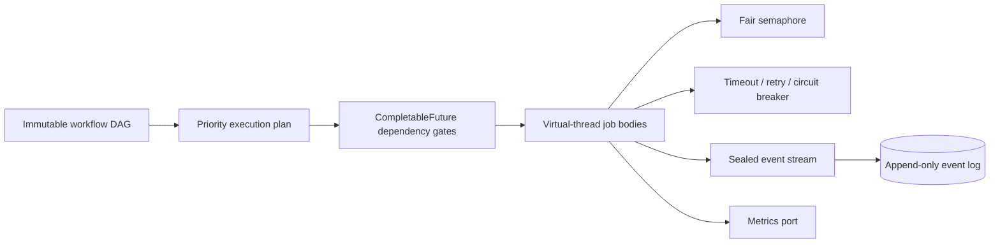

# task-orchestrator-java

[](https://github.com/NAOKI-Ko/task-orchestrator-java/actions/workflows/ci.yml)


[](LICENSE)

`task-orchestrator-java` is a compact workflow engine for safely executing dependency-aware jobs
in parallel. It focuses on modern Java's type system and concurrency model rather than wrapping a
CRUD framework.

## Why this exists

Batch and service code frequently mixes dependency ordering, futures, retry loops, timeouts and
shutdown into business logic. This engine makes those decisions explicit through an immutable DAG,
an exhaustive result algebra, typed events, and virtual-thread execution.

## Features

- deterministic priority-aware DAG planning, cycle detection and unknown-dependency validation
- Java 25 virtual threads with `ExecutorService`, `CompletableFuture`, and a fair concurrency limit
- generic job definitions and immutable record-based results
- explicit job state machine, cancellation, timeouts and graceful shutdown
- bounded exponential retry with jitter and a reusable circuit breaker
- failure propagation that skips unsafe downstream jobs
- sealed `JobStarted`, `JobCompleted`, `JobFailed`, `JobRetried`, `WorkflowCompleted`, and
  `WorkflowFailed` events
- replaceable event sink, append-only JSONL persistence, structured system logging, and metrics port
- JUnit 5, AssertJ, jqwik, JaCoCo, Checkstyle, SpotBugs and JMH quality tooling

## Architecture



See [docs/architecture.md](docs/architecture.md) for component responsibilities, data flow,
concurrency, errors, extension points and trade-offs.

## Installation

Java 25 is required. Build the source checkout with the verified Gradle wrapper:

```bash
git clone https://github.com/NAOKI-Ko/task-orchestrator-java.git
cd task-orchestrator-java
./gradlew build
```

The library JAR is produced under `build/libs/`. Binary, sources, and Javadoc JARs for a signed-off
version are also attached to its [GitHub Release](https://github.com/NAOKI-Ko/task-orchestrator-java/releases/tag/v0.1.0).

## Quick start

```java
var fetch = JobDefinition.of(new JobId("fetch"), context -> "payload");
var index = new JobDefinition<>(
    new JobId("index"), Set.of(fetch.id()), 10, Duration.ofSeconds(5),
    RetryPolicy.none(), context -> "indexed");

try (var engine = new WorkflowEngine(8, EventSink.noop(), Metrics.noop())) {
    WorkflowResult result = engine
        .execute(new WorkflowDefinition(List.of(fetch, index)))
        .join();
    System.out.println(result.succeeded());
}
```

## Examples

Three examples compile against the library and run through Gradle:

```bash
./gradlew runBasicExample
./gradlew runRetryExample
./gradlew runConcurrencyExample
```

They demonstrate durable events, bounded retries, and virtual-thread parallelism.

## Design decisions

- Records defensively copy collections; execution plans never expose mutable nested lists.
- Sealed results and events make pattern matching exhaustive at compile time.
- Virtual threads permit straightforward blocking timeout/retry code without consuming platform
  threads; a fair semaphore still protects limited downstream resources.
- Dependency failures become explicit `Failure` values with `dependencyFailure=true`.
- Persistence stores immutable failure metadata rather than retaining mutable `Throwable` objects.

## Testing

```bash
./gradlew check spotbugsMain spotbugsTest
```

The suite includes unit, integration, parallelism, retry, timeout, cancellation, persistence,
failure-propagation and jqwik property tests. JaCoCo checks both line and branch coverage and fails
if either falls below 90%.
Compilation enables all lint warnings and treats them as errors.

## Benchmark

JMH measures DAG validation and execution-plan construction for multiple graph sizes. Results are
machine-specific and are intentionally not claimed in this README.

```bash
./gradlew jmh
```

## Roadmap

- resumable workflows reconstructed from persisted events
- distributed execution and leader coordination
- OpenTelemetry spans and metrics adapter
- configurable durable queue backends

## Contributing

Read [CONTRIBUTING.md](CONTRIBUTING.md) before submitting changes. Report vulnerabilities through
the private process in [SECURITY.md](SECURITY.md). Maintainers should follow the reproducible
[release process](docs/releasing.md).

## License

MIT. See [LICENSE](LICENSE).
