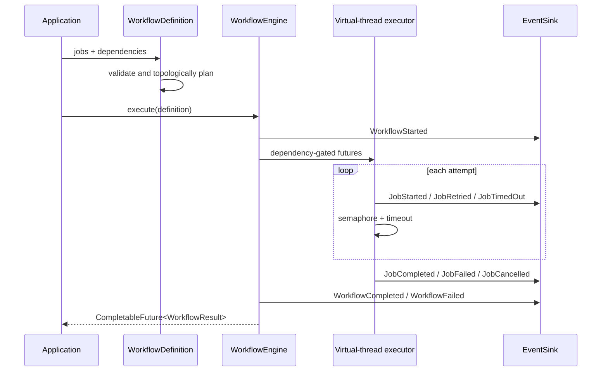

# Architecture

## System overview

The engine accepts an immutable collection of typed jobs, validates it as a DAG, creates a stable
priority execution plan, and maps every node to a `CompletableFuture`. Each future waits for its
dependency futures and then executes the job on a Java 25 virtual thread.

## Component responsibilities

- `WorkflowDefinition` validates identities, dependencies and cycles, then builds priority layers.
- `WorkflowEngine` owns virtual threads, futures, concurrency permits, cancellation and shutdown.
- `JobStateMachine` makes lifecycle violations observable programming errors.
- `JobDefinition<T>` and `JobResult<T>` preserve typed values through execution.
- `WorkflowEvent` is a sealed event algebra consumed by `EventSink`.
- `AppendOnlyEventStore` persists newline-delimited events behind `EventStore`.
- `RetryPolicy` and `CircuitBreaker` isolate resilience math and state.
- `Metrics` separates instrumentation from any monitoring vendor.
- `OrchestratorTelemetry` adapts those event and metrics ports to the OpenTelemetry API; SDK and
  exporter lifecycle remain in the hosting application.

## Data flow

Jobs enter as immutable definitions. Dependency futures yield immutable results; a non-successful
result causes downstream nodes to become `SKIPPED` without invoking user code. Successful actions
produce typed values. Events, duration metrics and structured logs are emitted at lifecycle
boundaries. The aggregate result is assembled in deterministic plan order.

## Concurrency model

`Executors.newVirtualThreadPerTaskExecutor()` schedules both dependency continuations and job
bodies. A fair `Semaphore` bounds bodies that may touch scarce resources. Each action runs in a
separate future so the orchestrator can enforce its timeout and interrupt the virtual thread.
Cancellation is cooperative through `JobContext`; engine close first signals cancellation, then
awaits termination and escalates to `shutdownNow` after the configured deadline.

## Error model

Graph errors fail synchronously before execution. Job exceptions are captured as immutable
`FailureInfo` values, retried according to policy, and never escape as unstructured exceptional
completion. Timeouts follow the same retry path. Cancellation has its own result variant. Failed
dependencies are distinguished from action failures. Exhaustive pattern switches derive workflow
status without default branches.

## Extension points

- implement `EventSink` for Kafka, telemetry or in-process listeners;
- implement `EventStore` for a database or durable stream;
- implement `Metrics` for OpenTelemetry, Micrometer or a custom backend;
- compose `CircuitBreaker` around job-specific downstream clients;
- build higher-level workflow DSLs that emit `JobDefinition<?>` values.

## Trade-offs

The event sink is synchronous to make durability guarantees explicit, so a slow adapter affects
job latency. The built-in log is local and not a distributed coordinator. Virtual threads simplify
blocking integrations, but users must still ensure native calls respond to interruption. A single
engine runs one workflow at a time to keep cancellation and observable state unambiguous; create
separate engines for independent workflows.
