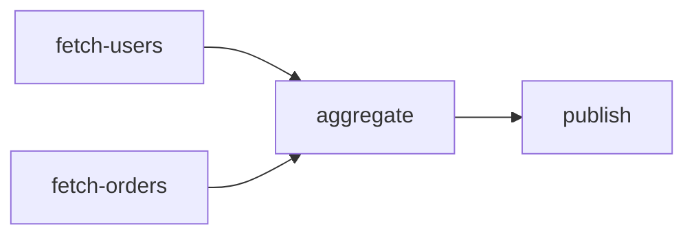

# Practical usage guide

This guide describes the behavior implemented by `task-orchestrator-java` today. The engine is an
in-process DAG executor: it validates and plans a complete workflow before starting, runs ready job
actions on Java 25 virtual threads, and returns an immutable result for every job.

## Fit and boundaries

The library is a good fit for a bounded workflow inside one JVM when:

- several jobs have explicit dependencies;
- independent jobs should run concurrently;
- priorities must make ready-job planning deterministic;
- retry, timeout, cancellation, event, and metrics policies should stay outside business code; or
- maintaining a web of hand-written `CompletableFuture` stages would obscure failure behavior.

It is not a distributed workflow service. Use a durable external platform for execution that must
survive process or host loss, span services or days, wait for human approval, or provide an
exactly-once processing guarantee. The append-only store records events locally but does not
reconstruct or resume a workflow.

## Failure propagation

The engine captures action failures in `JobResult.Failure` values. When a dependency is not
successful, the dependent action is never invoked. Its state becomes `SKIPPED`, and its result is a
failure with `dependencyFailure()` set to `true` and `attempts()` set to zero.

```java
var fetch = JobDefinition.of(new JobId("fetch"), context -> "payload");
var transform = new JobDefinition<>(
        new JobId("transform"),
        Set.of(fetch.id()),
        0,
        Duration.ofSeconds(2),
        RetryPolicy.none(),
        context -> { throw new IOException("invalid payload"); });
var persisted = new AtomicBoolean();
var persist = new JobDefinition<>(
        new JobId("persist"),
        Set.of(transform.id()),
        0,
        Duration.ofSeconds(2),
        RetryPolicy.none(),
        context -> { persisted.set(true); return "stored"; });

try (var engine = new WorkflowEngine(4, EventSink.noop(), Metrics.noop())) {
    var result = engine.execute(new WorkflowDefinition(List.of(fetch, transform, persist))).join();
    var persistFailure = (JobResult.Failure<?>) result.jobs().get(persist.id());
    assert persistFailure.dependencyFailure();
    assert !persisted.get();
}
```

This is value-based failure handling: a completed workflow future can contain unsuccessful job
results. Graph validation errors and engine lifecycle misuse still fail synchronously.

## Parallel DAG



```java
var users = JobDefinition.of(new JobId("fetch-users"), context -> List.of("Ada", "Linus"));
var orders = JobDefinition.of(new JobId("fetch-orders"), context -> List.of(7, 11));
var aggregate = new JobDefinition<>(
        new JobId("aggregate"),
        Set.of(users.id(), orders.id()),
        10,
        Duration.ofSeconds(5),
        RetryPolicy.none(),
        context -> "ready");
var publish = new JobDefinition<>(
        new JobId("publish"),
        Set.of(aggregate.id()),
        0,
        Duration.ofSeconds(5),
        RetryPolicy.none(),
        context -> "published");

var workflow = new WorkflowDefinition(List.of(users, orders, aggregate, publish));
assert workflow.plan().layers().equals(List.of(
        List.of(orders.id(), users.id()),
        List.of(aggregate.id()),
        List.of(publish.id())));
```

Jobs in the first layer are dependency-independent and may run in parallel. Ordering inside a ready
set is deterministic: higher priority comes first, with `JobId` as the tie-breaker. Completion order
can still vary because actions are concurrent.

## Retry and timeout

Timeout applies to each attempt rather than to the whole workflow. A timeout is handled like any
other failed attempt: the engine retries when attempts remain, otherwise it produces a failure.

```java
var attempts = new AtomicInteger();
var fetch = new JobDefinition<>(
        new JobId("fetch"),
        Set.of(),
        0,
        Duration.ofMillis(250),
        new RetryPolicy(
                3,
                Duration.ofMillis(50),
                Duration.ofMillis(500),
                2.0,
                0.1),
        context -> {
            context.throwIfCancelled();
            if (attempts.incrementAndGet() < 2) {
                throw new IOException("temporary reset");
            }
            return "payload";
        });
```

The initial attempt is included in `maxAttempts`. Backoff is capped at `maxDelay`; jitter is a
symmetric ratio around the bounded exponential delay. Job code should choose idempotent retry
boundaries and avoid retrying irreversible side effects without an application-level strategy.

## Cancellation and shutdown

`WorkflowEngine.cancel()` sets a shared cooperative flag. A queued job observes it before its
action starts; a running job can call `JobContext.throwIfCancelled()` at safe boundaries. The call
does not forcibly stop arbitrary blocking code.

Use the engine in try-with-resources. `close()` requests cancellation, stops accepting new work,
waits up to the configured shutdown timeout, and then calls `shutdownNow()` to interrupt remaining
virtual threads. External clients and native operations must define compatible timeout and
interruption behavior.

## Virtual threads and the concurrency limit

The executor creates a virtual thread per asynchronous continuation or submitted action. Virtual
threads make blocking code scalable to represent, but they do not protect databases, HTTP APIs, or
other scarce resources. A fair semaphore separately limits the number of active action bodies.
Waiting virtual threads acquire permits in arrival order.

Set the engine concurrency limit from downstream capacity. For independent workflows with distinct
cancellation and lifecycle state, use separate engine instances.

## Events, persistence, and metrics

The engine synchronously publishes sealed `WorkflowEvent` values. A slow sink adds latency, and a
sink exception is not automatically swallowed; adapters should define deliberate retry or
durability behavior.

`AppendOnlyEventStore` serializes selected event metadata as UTF-8 JSONL in emission order. The
application owns file rotation, retention, access control, and log shipping. Payload values are not
persisted by the built-in store.

The `Metrics` port currently receives per-job counters and nanosecond durations. `InMemoryMetrics`
is suitable for tests and embedded inspection; production adapters decide aggregation and export.

## Approach comparison

| Approach | Best fit | Operational boundary |
| --- | --- | --- |
| Raw `CompletableFuture` | Small custom compositions with few reusable policies | Application owns every dependency and failure rule |
| `task-orchestrator-java` | Bounded in-process DAGs with typed results and reusable execution policy | Process-local execution and state |
| External workflow platform | Durable, distributed, cross-service, long-running, or human workflows | Additional service and operational control plane |

## API map

- Definition: `WorkflowDefinition`, `WorkflowDefinition.ExecutionPlan`
- Jobs: `JobDefinition<T>`, `JobId`, `JobAction<T>`, `JobContext`
- Execution: `WorkflowEngine`, `WorkflowResult`, `JobResult<T>`, `JobState`
- Resilience: `RetryPolicy`, `CircuitBreaker`
- Events: `WorkflowEvent`, `EventSink`
- Persistence: `EventStore`, `AppendOnlyEventStore`
- Metrics: `Metrics`, `InMemoryMetrics`

See the runnable `BasicExample`, `RetryExample`, and `ConcurrencyExample` sources for complete class
and import declarations.
